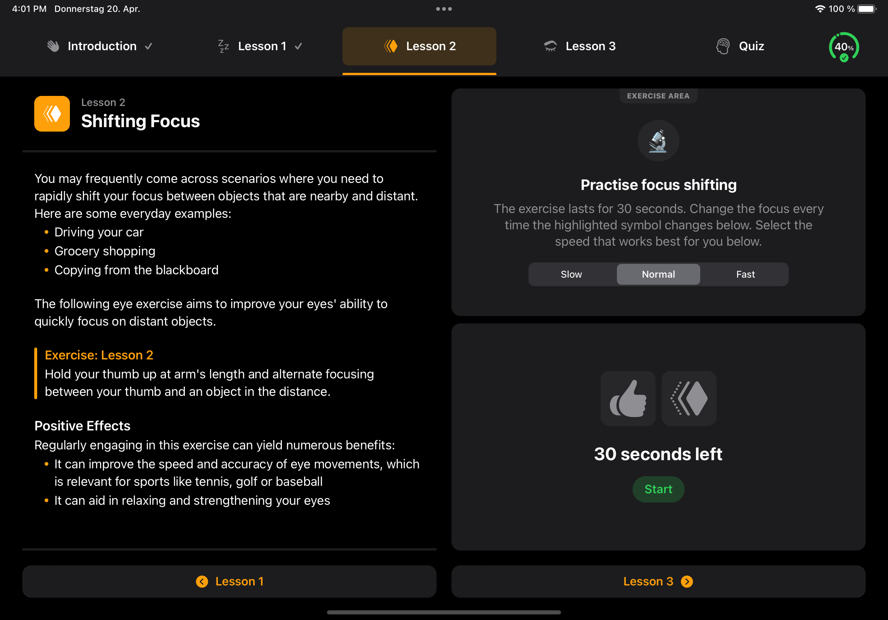
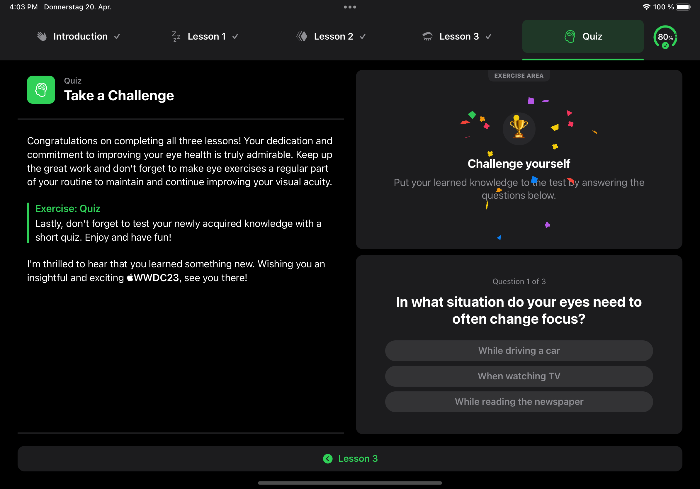

## 👀 A First Overview

Welcome to this year's **WWDC23** Swift Student Challenge! I'm very proud to present you my submission called `Visionize`. I wanted to take part in this challenge to deepen my newly gained coding skills and learn more about the amazing world of app development with Swift and SwiftUl.

Our eyes are truly remarkable and vital to our overall well-being! Nevertheless, we often neglect them when we think about our health. They help us perceive the world around us every single day, so we should take the time to take care of them. That's why I created `Visionize` as part of this year's Swift Student Challenge and I'm thrilled to share it with you!

Thanks to the power of SwiftUI, you can enjoy a sleek and stylish interface that's easy on the eyes and super intuitive to use. It works perfectly on all iPads, no matter what orientation or appearance you prefer. I highly recommend using the app in horizontal orientation, with a dark appearance and sounds turned on. This will ensure that you get the most out of the lessons and exercises.

## 📱 Used Technologies
* SwiftUI
* AVFoundation

## ⚙️ System Requirements
_Developed with_
* Xcode 14.3 with Swift 5.8 on macOS Ventura 13.3.1

_Tested with_
* Xcode Simulator with iPad Pro (11-inch) (4th generation) on iPadOS 16.4

## 🎊 Sneak Peek
 
 

---

## License
Distributed under the MIT License. See `LICENSE` for more information.
